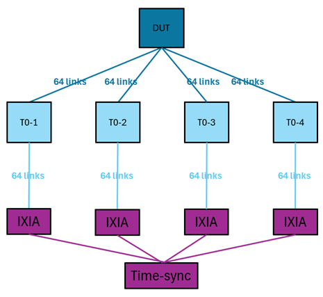

# SONiC Switch High-Scale IPv6 BGP Test

- [SONiC Switch High-Scale IPv6 BGP Test](#sonic-switch-high-scale-ipv6-bgp-test)
  - [Test Objective](#test-objective)
  - [Test Setup](#test-setup)
  - [Test Cases](#test-cases)
    - [Case 1](#case-1)
    - [Objective](#objective)
      - [Steps](#steps)
    - [Case 2](#case-2)
      - [Objective](#objective-1)
      - [Steps](#steps-1)
    - [Case 3](#case-3)
      - [Objective](#objective-2)
      - [Steps](#steps-2)
  - [Metrics](#metrics)

## Test Objective

This test verifies the scalability and stability of multiple BGP sessions on a SONiC switch. BGP sessions will be established between each Ethernet logical port of the DUT and its neighboring devices. The test evaluates the DUT’s ability to initiate and maintain BGP sessions, validates proper route learning, and measures BGP update convergence time under various conditions.

## Test Setup

This test is designed to be topology-independent:

- It does not assume or enforce a specific network layout.
- The only requirement is that the DUT is fully connected to handle full traffic loads under stress.
- All logical Ethernet ports are utilized to establish BGP sessions. If the DUT has X logical Ethernet ports and is connected to Y neighboring switches, the test will establish X/Y BGP sessions between each neighbor and the DUT. In the example below, the DUT has 256 logical Ethernet ports and is connected to 4 neighboring switches. This results in 64 BGP sessions being established between the DUT and each neighbor.

1. **Assign Unique ASNs**

   Assign a distinct Autonomous System (AS) number to each of the five switches in the setup.
2. **Establish BGP Sessions Between DUT and Neighbors**

   For each neighboring switch connected to the Device Under Test (DUT), configure BGP sessions.
   - Each BGP session should use a dedicated pair of Ethernet ports (one on the DUT, one on the neighbor), configured with IPv6 addresses in the same subnet.
   - Set up the corresponding BGP neighbors, device neighbor mappings, and port IPv6 addresses.
3. **Verify DUT BGP Sessions**

   On the DUT, confirm that all BGP sessions are successfully established and error-free, by run `show ipv6 bgp summary`.
4. **Establish BGP Sessions Between Neighbors and Traffic Generators**

   For each neighboring switch, identify its directly connected traffic generator. Configure Z BGP sessions, where Z is the number of links connecting the neighboring switch and the traffic generator.
   - Again, each session should use a dedicated port pair with IPv6 addresses in the same subnet.
   - Configure the BGP neighbors, device neighbors mappings, and port IPv6 addresses accordingly.
   - Initialize route advertisement from the traffic generators.
5. **Verify Neighbor BGP Sessions**

   On each neighboring switch, run `show ipv6 bgp summary` to verify session establishment.
6. **Configure Routes on Traffic Generators**

   - Configure the required number of IPv6 routes on each traffic generator, based on the test scenario.
7. **Verify Route Learning on the DUT**

   - On the DUT, run `show ipv6 route bgp` to confirm that all expected routes are learned and properly installed into the routing table.

## Test Cases

### Case 1

### Objective

Measure BGP convergence time when a single BGP session experiences a flap (i.e., goes down and then comes back up).

#### Steps

1. Shut down one interface on the DUT. Wait till all routes advertised by the impacted BGP session are removed.
2. Bring up the interface and measure the time for BGP session and route reestablishment, by running `show ipv6 bgp summary`
and `show ipv6 route bgp`.
3. Repeat this process and calculate the average update time of this scenario.

### Case 2

#### Objective

Measure BGP convergence time following a BGP container restart on the Device Under Test (DUT).

#### Steps

1. Stop the BGP container on the DUT. Wait till all BGP routes are removed.
2. Bring up the BGP container and measure the time for BGP session and route reestablishment, by running `show ipv6 bgp summary`
and `show ipv6 route bgp`.
3. Repeat this process and calculate the average update time of this scenario.

### Case 3

#### Objective

Measure BGP convergence time during nexthop withdrawal (reduction) and subsequent restoration, evaluating how quickly the DUT updates and reinstates routing information.

#### Steps

1. In one of the DUT neighboring switches, run `show ipv6 bgp network <ipv6>/<prefix>` and determine how many next hops are currently available to reach `<ipv6>/<prefix>`.
2. Collect the existing BGP routes on the DUT by running `docker exec bgp vtysh -c 'show ipv6 route bgp json'`. Save the result in a variable named originalRoutes.
3. Randomly select half of the next hops and remove them. Calculate resulted routes by calling `tests/bgp/test_ipv6_bgp_scale.py:remove_nexthops_in_routes()`.
4. Continuously monitor the route information until it matches the expected state by using `tests/bgp/test_ipv6_bgp_scale.py:compare_routes()`. Record the time taken — this is the BGP convergence time for route withdrawal.
5. Restore the previously removed nexthops.
6. Again, monitor the route information until it matches originalRoutes. Record the time taken — this is the BGP convergence time for route restoration.
7. Repeat the test multiple times and calculate the average convergence time for this scenario.

## Metrics

Save the BGP convergence time (measured in seconds) to a database via the final metrics reporter interface provided by the SONiC team in `test_reporting` folder. An example of how to use the interface is provided in `telemetry` folder.

| User Interface Label                                 | Label Key in DB                         | Example Value       |
| ---------------------------------------------------- | --------------------------------------- | ------------------- |
| `METRIC_LABEL_DEVICE_ID`                             | device.id                               | switch-A            |

| User Interface Metric Name                           | Metric Name in DB                       | Example Value       |
| ---------------------------------------------------- | --------------------------------------- | ------------------- |
| `METRIC_NAME_BGP_CONVERGENCE_TIME_PORT_RESTART`      | bgp.convergence_time.port_restart       | 15                  |
| `METRIC_NAME_BGP_CONVERGENCE_TIME_CONTAINER_RESTART` | bgp.convergence_time.container_restart  | 72                  |
| `METRIC_NAME_BGP_CONVERGENCE_TIME_NEXTHOP_CHANGE`    | bgp.convergence_time.nexthop_change     | 60                  |
