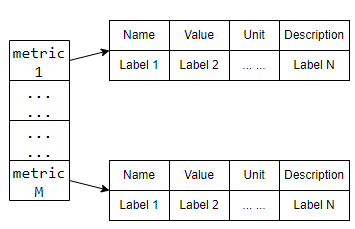

# SONiC Switch Latency Test

## Table of Contents

- [SONiC Switch Latency Test](#sonic-switch-latency-test)
  - [Table of Contents](#table-of-contents)
  - [Test Objective](#test-objective)
  - [Test Setup](#test-setup)
  - [Test Steps](#test-steps)
  - [Metrics Processing](#metrics-processing)

## Test Objective

This test aims to measure the latency introduced by a switch under the fully loaded condition.

## Test Setup

The test is designed to be topology-agnostic, meaning it does not assume or impose a specific network connection. The only requirement is that the DUT is fully connected to handle full traffic loads under stress. Plus all traffic generators in the testbed must be time synchronized.

> **Notice**: Currently, we are testing exclusively in store-and-forward mode.

## Test Steps

1. Switch wiring: All DUT ports are connected to traffic generators, directly or indirectly.

2. Following the steps outlined in the snappi BGP test plan and IPv6 route scaling test plan, establish the required IPv6 BGP sessions and IPv6 routes.
3. Configure traffic items on the traffic generators to ensure that every port of the DUT receives traffic flow, and every route on the DUT is executed. For example, For each of the four traffic generators: define two topologies, each containing four **physical** ports. Configure and bring up Layer 2 and Layer 3 protocols for both topologies. Define two uni-directional traffic items in IXIA-1, one traffic item is destined for IXIA-2, the other traffic item is destined for IXIA-4, both of them are full mesh. Set each traffic item’s rate to 60% of the line rate, with a packet size of 1024 bytes. Define two uni-directional traffic items in IXIA-2, one traffic item is destined for IXIA-1, the other traffic item is destined for IXIA-3.  So on and so forth.

4. Start all the traffic items simultaneously and run them for 1 minute. Record latency statistics and compare latency differences between the two traffic items sourced from each traffic generator.

5. Repeat the test with frame size 64 bytes, 1024 bytes, 4096 bytes, and 8192 bytes to analyze how packet size impacts latency.

6. Increase each traffic item's rate from 60% to 70%, 80%, and 90% of the line rate, respectively. Repeat the above three steps. Observe how latency changes in relation to packet loss. Note: Latency measurements may be skewed due to packet loss, as lost packets are counted as having infinite latency. This issue should be addressed to ensure accurate results.

## Oversubscription Test Case

This test is conducted in a one-tier network to evaluate latency under an oversubscribed state.

1. Assume the DUT has X ports connected to traffic generators. Assume the DUT has X ports connected to traffic generators. Randomly select one port on a traffic generator as the Rx port, and designate the remaining (X-1) ports as Tx ports.
2. Define (X-1) traffic items, each assigned to a different Tx port, using a frame size of 86 bytes. Set each traffic stream's rate to `(line_rate × 110%) / X` to create an oversubscribed condition.
3. Start all the traffic items simultaneously and run them for 1 minute. Record latency statistics.
4. Repeat the test with frame size 1024 bytes, 4096 bytes, and 8192 bytes.
5. Analyze the results by comparing latency measurements across different frame sizes, identifying any patterns or anomalies, and determining how oversubscription affects latency performance.

## Metrics Processing

Latency data is collected and stored periodically. The diagram below illustrates how it is organized in the database. For more details, refer to `test_reporting/telemetry/README.md`.



For each of the above results, save the latency figures in nanoseconds to a database via the telemetry interface provided by the SONiC team. An example of how to use the interface is provided in telemetry folder. The metrics are stored as data points in our database.

In addition to the common labels below

```python
METRIC_LABEL_TEST_CASE: Final[str] = "test.testcase"
METRIC_LABEL_TEST_FILE: Final[str] = "test.file"
```

The following labels should also be provided:

```python
METRIC_LABEL_DEVICE_ID: Final[str] = "device.id"
METRIC_LABEL_DEVICE_INGRESS_PORT_ID: Final[str] = "device.ingress_port.id"
METRIC_LABEL_DEVICE_EGRESS_PORT_ID: Final[str] = "device.egress_port.id"
METRIC_LABEL_TRAFFIC_RATE: Final[str] = "traffic.rate"               # Measured as a percentage of the line rate
METRIC_LABEL_TRAFFIC_PACKET_SIZE: Final[str] = "traffic.packet_size" # Measured in bytes
METRIC_LABEL_TRAFFIC_RFC2889_FLAG: Final[str] = "traffic.rfc2889_flag"
```

Three metrics are collected and stored.

```python
METRIC_NAME_MIN_LATENCY: Final[str] = "latency.min"
METRIC_NAME_MAX_LATENCY: Final[str] = "latency.max"
METRIC_NAME_AVG_LATENCY: Final[str] = "latency.avg"
```

Categorize latency results into multiple bins based on time intervals. Analyze the distribution to better understand latency characteristics.
