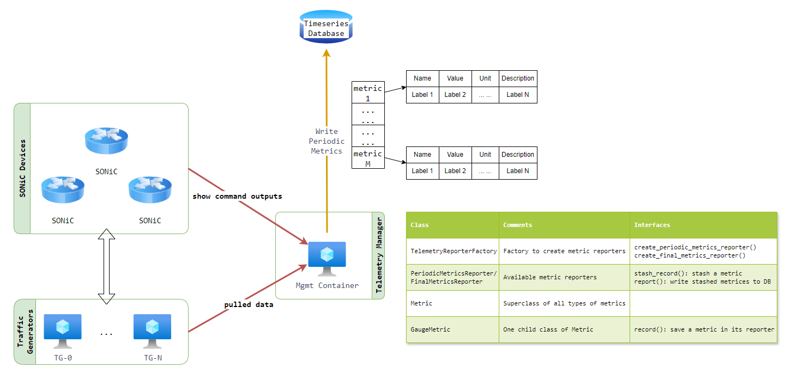

# Overview
This toolkit is a framework designed to manage telemetry data, including (but not limited to) traces, metrics, and logs.
It also provides a user interface to take and organize the collected data.



## How it works
### Organization of Metric Labels
Each telemetry data point is identified by labels, which are organized into two levels:

    Test-Level Labels:
    These labels provide general information shared by all metrics within a test, such as:
        Testbed
        Test case
        Running build version
        Test job ID

    Metric-Specific Labels:
    These labels are unique to individual metrics, such as:
        ID of the component where the metric is generated
        Component model number
        Component serial number

### User interface and backend operations
    Frontend:
    The user interface accepts a metric's name, value along with its associated labels.

    Backend:
    The framework performs the following operations:
    Creates a data entry for the submitted metric.
    Exports the data entry to a database.

    Reporters:
    Metrics collected periodically are handled by the PeriodicMetricsReporter.
    Final status data for test results are handled by the FinalMetricsReporter.
    The framework is designed to support the addition of new reporters and metric types, offering scalability and flexibility.

## How to use
An example of using this tool to report a switch's PSU metrics is provided.
1) Collect test-level information and generate common labels.
```
    common_labels = {
        METRIC_LABEL_TESTBED: "TB-XYZ",
        METRIC_LABEL_TEST_BUILD: "2024.1103",
        METRIC_LABEL_TEST_CASE: "mock-case",
        METRIC_LABEL_TEST_FILE: "mock-test.py",
        METRIC_LABEL_TEST_JOBID: "2024_1225_0621"
    }
```

2) Create a metric reporter using the common labels.
```
    reporter = TelemetryReporterFactory.create_periodic_metrics_reporter(common_labels)
```

3) Collect device, component information, along with metrics' names and values.
```
    metric_labels = {METRIC_LABEL_DEVICE_ID: "switch-A"}

    voltage = GaugeMetric(name="Voltage",
                          description="Power supply unit voltage reading",
                          unit="V",
                          reporter=reporter)

    current = GaugeMetric(name="Current",
                          description="Power supply unit current reading",
                          unit="A",
                          reporter=reporter)

    power = GaugeMetric(name="Power",
                        description="Power supply unit power reading",
                        unit="W",
                        reporter=reporter)
```

4) Generate metric-specific labels and record metrics, one metric at a time.
```
    metric_labels[METRIC_LABEL_DEVICE_PSU_ID] = "PSU 1"
    metric_labels[METRIC_LABEL_DEVICE_PSU_MODEL] = "PWR-ABCD"
    metric_labels[METRIC_LABEL_DEVICE_PSU_SERIAL] = "1Z011010112349Q"
    voltage.record(metric_labels, 12.09)
    current.record(metric_labels, 18.38)
    power.record(metric_labels, 222.00)
```

5) Report the metrics.
```
    reporter.report()
```

6) Access the data entries in the database using tools like Grafana.

## Rules
Only labels defined in metrics.py are permitted.
Ensure proper use of labels to maintain consistency and compatibility with the framework.
